# LightRidge: An End-to-end Agile Design Framework for Diffractive Optical Neural Networks

### ASPLOS submission number: #132


## Overview of LightRidge Design Flow


#### LightRidge is the first open-source end-to-end optical ML compilation framework for diffractive optical computing, which consists of 

	- (a) precise and differentiable optical physics kernels that enable complete explorations of diffractive optical neural networks (DONNs) architectures, 
	- (b) optical physics computation kernel acceleration that significantly reduces the runtime cost in training, emulation, and deployment of DONNs, and 
	- (c) versatile and flexible optical system modeling and user-friendly domain-specific-language (DSL).

## Illustration of DONN and System Prototype
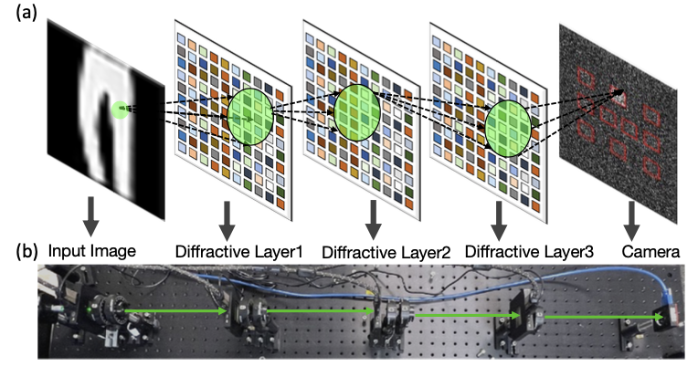

As shown in above figure, in a DONN system, diffractive layers are stacked in sequence. The light signal carrying the input information propagates, diffracts, and is phase-modulated at each diffractive layer.

## Case study of LightRridge end-to-end design and prototype validation

```python
class DiffractiveClassifier_CoDesign(torch.nn.Module):
    def __init__(self, phase_func, intensity_func, device, det_x_loc, det_y_loc, 
    det_size, wavelength=5.32e-7, pixel_size=0.000036, batch_norm=False, sys_size = 200, pad = 100, 
    distance=0.1, num_layers=2, precision=256, amp_factor=6, approx="Fresnel"):
        super(DiffractiveClassifier_CoDesign, self).__init__()
        self.amp_factor = amp_factor
        self.size = sys_size
        self.distance = distance
        self.wavelength = wavelength
        self.pixel_size = pixel_size
        self.pad = pad
        self.approx=approx
        self.det_size = det_size
        self.phase_func = phase_func.to(device)
        self.intensity_func = intensity_func.to(device)
        self.approx=approx
        self.diffractive_layers = torch.nn.ModuleList([layers.DiffractiveLayer(
        self.phase_func, self.intensity_func, wavelength=self.wavelength, pixel_size=self.pixel_size,
                size=self.size,pad = self.pad, distance=self.distance, amplitude_factor = amp_factor, approx=self.approx, phase_mod=True) 
                for _ in range(num_layers)])
        self.last_diffraction = layers.DiffractiveLayer(None, None, wavelength=self.wavelength, pixel_size=self.pixel_size,
                size=self.size, pad = self.pad, distance=self.distance, approx=self.approx, phase_mod=False)
```

Training code can be found at ```ASPLOS2023_lightridge_code_sample.ipynb```


## Validation of the DONN system on MNIST-10
### (1) Hardware Prototype
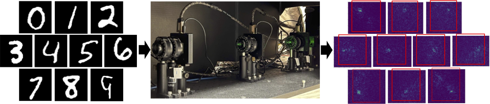

### (2) Full Propagation visualization
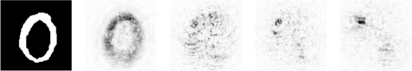
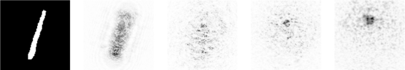
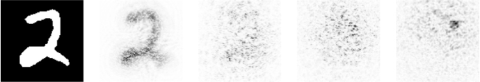
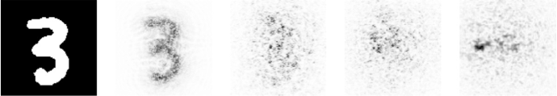
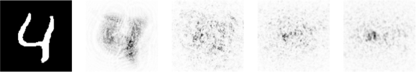
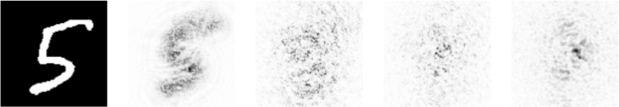
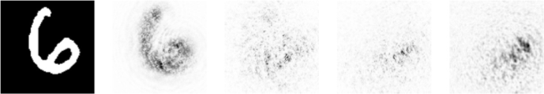
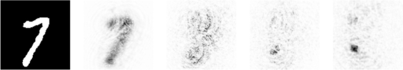
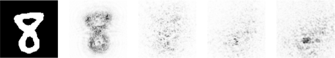
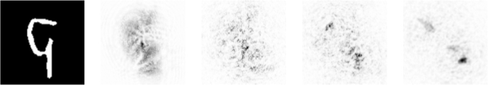


 