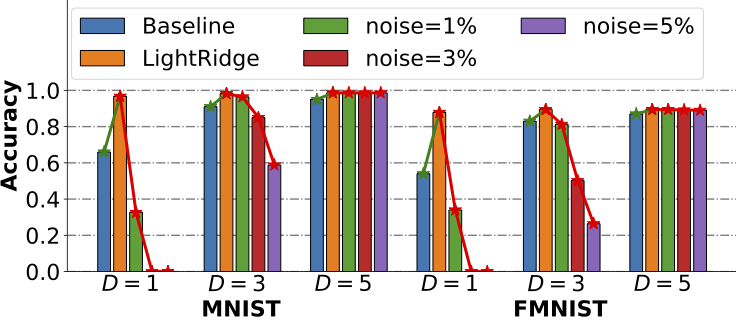
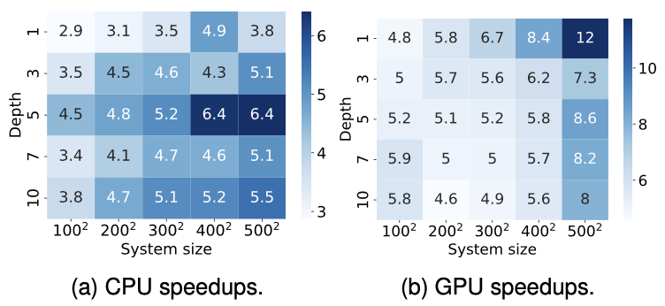
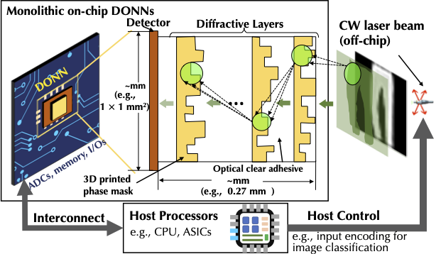
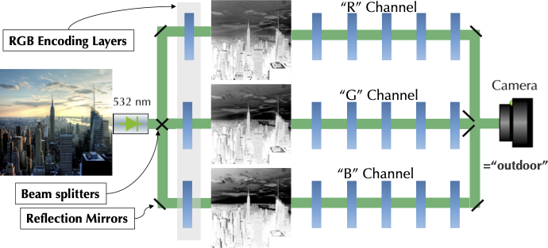
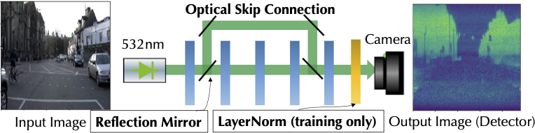
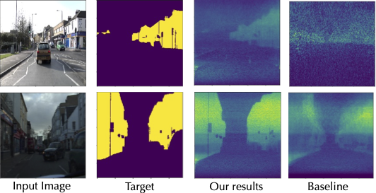

# LightRidge: An End-to-end Agile Design Framework for Diffractive Optical Neural Networks

### ASPLOS submission number: #132
## DONN System Illustration

## Overview of LightRidge Design Flow

## Validation of the DONN system
### (1) Hardware Prototype

### (2) Full Propagation visualization

## Emulation-level Evaluation (with Confidence Test)

## Runtime Evaluation

## On-chip Integration

## Advanced DONN Architectural Design
### RGB images classification

### All-optical image segmentation

